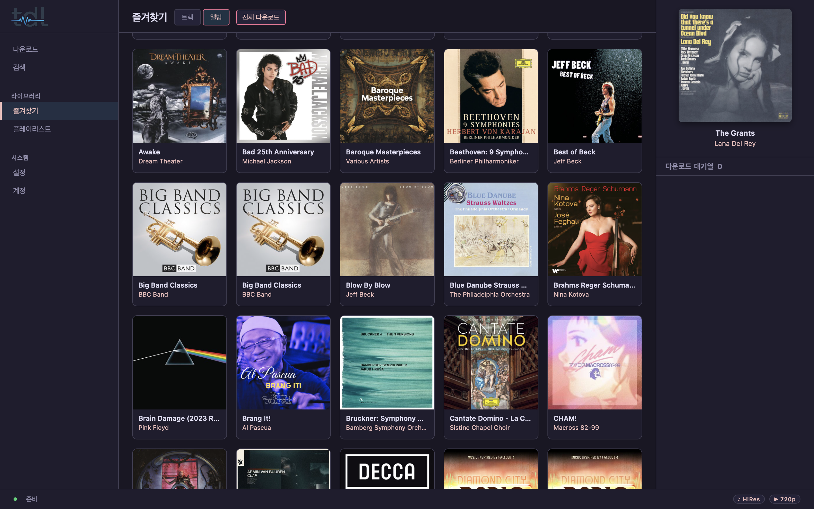

<div align="center">

[](https://github.com/epicsagas/tdl/actions/workflows/ci.yml)
[](https://crates.io/crates/tdl)
[](../../LICENSE)
[](#installation)

**[English](../../README.md)** | [한국어](README.ko.md) | [日本語](README.ja.md) | [简体中文](README.zh-CN.md) | [Español](README.es.md) | [Français](README.fr.md) | [Deutsch](README.de.md) | [Português](README.pt.md) | [Русский](README.ru.md) | [Italiano](README.it.md)

# tdl

> Tidal音楽ダウンローダー — ロスレス品質、CLI/TUI/GUI対応

</div>



## クイックスタート

```bash
# macOS / Linux
brew install epicsagas/tap/tdl

# プリビルドバイナリ (Linux/macOS/Windows)
curl --proto '=https' --tlsv1.2 -sSf https://raw.githubusercontent.com/epicsagas/tdl/main/scripts/install.sh | sh

# Cargo
cargo install --git https://github.com/epicsagas/tdl
```

```bash
tdl login              # OAuthデバイス認証
tdl dl <tidal-url>     # トラック/アルバム/プレイリストをダウンロード
```

## 機能

| | 機能 | 説明 |
|--|---------|----------------|
| 🎵 | **ロスレス品質** | HiRes Lossless (24-bit/192kHz) 対応 |
| 🖥️ | **3つのインターフェース** | CLI、TUI、GUI — 好きなスタイルを選択 |
| ⚡ | **並列ダウンロード** | リトライ付き同時セグメント取得 |
| 🏷️ | **メタデータタグ付け** | FLAC/M4Aタグ、ReplayGain、歌詞、カバーアート |
| 🔄 | **PKCEログイン** | HiRes品質用のセキュアOAuth |
| 📺 | **動画対応** | ミュージックビデオのダウンロードとMP4変換 |
| 🎨 | **TUI & GUI** | お気に入りを閲覧、検索、対話的ダウンロード |

## インストール

### Homebrew (macOS/Linux)

```bash
brew install epicsagas/tap/tdl
```

### プリビルドバイナリ

```bash
# macOS / Linux
curl --proto '=https' --tlsv1.2 -sSf https://raw.githubusercontent.com/epicsagas/tdl/main/scripts/install.sh | sh

# Windows (PowerShell)
irm https://raw.githubusercontent.com/epicsagas/tdl/main/scripts/install.ps1 | iex
```

### ソースからビルド

```bash
git clone https://github.com/epicsagas/tdl.git
cd tdl
cargo build --release
# バイナリ: target/release/tdl
```

## 使用方法

### ログイン

標準OAuth (HiFi品質まで):

```bash
tdl login
```

HiRes Lossless用PKCEフロー:

```bash
tdl login --pkce
```

### ダウンロード

```bash
# トラック
tdl dl https://tidal.com/browse/track/12345

# アルバム / プレイリスト / ミックス
tdl dl https://tidal.com/browse/album/67890
tdl dl https://tidal.com/browse/playlist/abc-uuid

# 複数のURL
tdl dl <url1> <url2>

# ファイルから
tdl dl --list urls.txt
```

### TUI & GUI

```bash
# ターミナルUI
tdl tui

# GUI (Tauri)
tdl gui
# または単に
tdl
```

### 設定

設定ファイル: `~/.tdl/settings.json`

```bash
# インタラクティブウィザード
tdl cfg

# エディタで開く
tdl cfg --editor
```

| 設定 | デフォルト | 説明 |
|---------|---------|-------------|
| `download_base_path` | `~/download` | ルートディレクトリ |
| `quality_audio` | `low_320k` | `low_96k` / `low_320k` / `high_lossless` / `hi_res_lossless` |
| `quality_video` | `p480` | `p360` / `p480` / `p720` / `p1080` |
| `track_num_pad_zero` | `true` | トラック番号のゼロ埋め |
| `playlist_folder` | `true` | `Playlists/`配下にプレイリストを保存 |
| `skip_existing` | `true` | 既存ファイルをスキップ |
| `extract_flac` | `true` | M4A/MP4からFLACを抽出 |
| `video_convert_mp4` | `true` | TSをMP4に変換 |

## なぜtdlなのか？

| | tdl | spotdl | yt-dlp |
|-|-----|--------|--------|
| オーディオ品質 | ✅ HiRes Lossless | ⚠️ 最大320kbps | ⚠️ 可変 |
| 動画対応 | ✅ ネイティブ | ❌ | ✅ |
| TUI/GUI | ✅ 両対応 | ❌ | ❌ |
| メタデータ | ✅ 完全 | ⚠️ 基本 | ⚠️ 基本 |
| 歌詞 | ✅ 同期済み | ✅ | ⚠️ 時々 |
| 無料プラン | ❌ サブスクリプション必要 | ❌ サブスクリプション必要 | ✅ 可能 |

## 出力構造

```
{base}/
  {artist}/
    {album}/
      01. Track Title.flac
      02. Another Track.flac
      cover.jpg

  Playlists/               # playlist_folder = trueの時
    My Playlist/
      01. Artist - Title.flac
      My Playlist.m3u
```

## 動作環境

- **OS**: macOS 12+ / Ubuntu 20.04+ / Windows 10+
- **Rust**: 1.80+ (ソースからビルドする場合)
- **FFmpeg**: オプション — 動画変換とFLAC抽出用
- **Tidal**: Premium、HiFi、またはHiFi Plusサブスクリプション

## トラブルシューティング

<details>
<summary>インストール後にコマンドが見つからない</summary>

インストールパスをPATHに追加してください:

```bash
# Rust/Cargo
export PATH="$HOME/.cargo/bin:$PATH"

# ローカルインストール
export PATH="$HOME/.local/bin:$PATH"
```
</details>

<details>
<summary>FFmpegが見つからないエラー</summary>

FFmpegをインストールしてください:

```bash
# macOS
brew install ffmpeg

# Ubuntu/Debian
sudo apt install ffmpeg

# Windows (Chocolatey)
choco install ffmpeg
```
</details>

## 貢献

[CONTRIBUTING.md](../../CONTRIBUTING.md)をご覧ください。PR歓迎 — `good first issue`ラベルのついたイシューを確認してください。

## ライセンス

[Apache-2.0](../../LICENSE) © 2025
